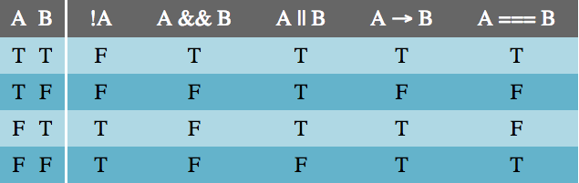

# Class 2 Notes

## [Introduction HTML](https://developer.mozilla.org/en-US/docs/Learn/HTML/Introduction_to_HTML/)

+ Why is it important to use semantic elements in our HTML? 

  + To give meaning the elements name and makes their roles clear 

+ How many levels of headings are there in HTML? 

  + 6 levels 

+ What are some uses for the `<sup>` and `<sub>` elements? 

  + To markup dates, chemical formulas ormathematical equations 

+ When using the `<abbr>` element, what attribute must be added to provide the full expansion of the term? 

  + Title attribute

## [Learn CSS-How CSS is Structured](https://developer.mozilla.org/en-US/docs/Learn/CSS/First_steps/How_CSS_is_structured)

+ What are ways we can apply CSS to our HTML? 

  + External stylesheet 

  + Internal stylesheet 

  + Inline style 

+ Why should we avoid using inline styles? 

  + Not best practice  

  + least efficient   

+ Review the block of code below and answer the following questions: 

+ What is representing the selector? 

  + `h2` header 

+ Which components are the CSS declarations?	 

  + Color: black; 

  + Padding: 5px; 

+ Which components are considered properties? 

  + Color 

  + padding 

``` 
  h2 { 
     color: black; 
     padding: 5px; 
   } 
``` 

## [Learn JS](https://developer.mozilla.org/en-US/docs/Learn/Getting_started_with_the_web/JavaScript_basics)

+ What data type is a sequence of text enclosed in single quote marks? 

   + string 

+ List 4 types of JavaScript operators. 

  + `=`  assignment 

  + `+` addition 

  + `-` subtraction 

  + `===` strict equals 

+ Describe a real world Problem you could solve with a Function. 

  + Making a budget  

## [Making Decisions In Your Code - Conditionals](https://developer.mozilla.org/en-US/docs/Learn/JavaScript/Building_blocks/conditionals)

+ An if statement checks a _ **Condition** _ and if it evaluates to __**true**_, then the code block will execute. 

+ What is the use of an `else if`? 

  + Use to chain if statement together  

+ List 3 different types of comparison operators. 

  + `<` less than 

  + `>` greater than 

  + `<=` less than or equal to  

+ What is the difference between the logical operator `&&` and `||`? 

  + Or - || either true 

  + And - && both true 

  
  
## Things I want to know more about

+ How to use a drop down list
+ how to make use events to make changes using a drop down list

© Marco Villafana 201d93