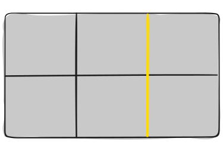

# Class 11 Notes

## [Video and Audio Content](https://developer.mozilla.org/en-US/docs/Learn/HTML/Multimedia_and_embedding/Video_and_audio_content)

- Describe the use of the `src` and `controls` attributes in the `<video>` element. 

  - `src` (source) attribute contains a path to the video you want to embed 

  - `controls` let the user use the browsers own control interface for video playback 

- Why is it important to have fallback content inside the `<video>` element? 

  - This will be displayed if the browser accessing the page doesn't support the `<video>` element, so you can use a link to redirect to another source of the video 

## [A complete Guide To Grid](https://css-tricks.com/snippets/css/complete-guide-grid/)

- How does Grid layout differ from Flex? 

  - Flex layout deals with one dimensional layout – either a row or a column  

  - Grid layout deals with two-dimensional layout- rows, and columns at the same time 

- Grid container, grid item, and grid line are a few important terms to understand when using Grid. Please describe these terms in a few sentences. 

  - Grid container – it’s the direct parent of all the grid items  

  - Grid item – the children of the gird container 

  - Grid line – the dividing lines that make up the structure of the grid 

## [Responsive Images](https://developer.mozilla.org/en-US/docs/Learn/HTML/Multimedia_and_embedding/Responsive_images)

- Besides making a site visually appealing across different screen sizes, why should developers make images responsive? 

  - To avoid overlap between rendered elements  

- Define the following `` attributes `srcset` and `sizes`. Write an example of how they are used. 

  - `` - element embeds an image into the document  

  - `srcset` - the set of images we will allow the browser to choose between 

  - `sizes` - set of source sizes 

- How is `srcset` more helpful for responsive images than CSS or JavaScript? 

  - allows you to define a list of different image resources along with size information so that browser can pick the most appropriate image based on the actual device's resolution 

## Things I want to know more about

+ How to use vector graphics
- How to make vector graphics

© Marco Villafana 201d93